# Semana 5 - Containerizacao e CI/CD

> Evidências coletadas em 05/10/2026. As capturas ficam em `docs/semana5/img/`.

## 1. Identificacao

- **Formato:** trabalho individual
- **Integrante:** João Paulo Barbosa Pereira Nunes
- **Repositório:** https://github.com/jpnunes2210/semana5-cicd
- **Descrição:** aplicação desacoplada Django + Next.js + PostgreSQL + Nginx. O backend expõe `GET /api/health/` em JSON e o frontend consome esse endpoint no navegador. O projeto foi containerizado para desenvolvimento e produção, com CI fail-fast no GitHub Actions e publicação das imagens de produção no GitHub Container Registry (GHCR).

## 2. Arquitetura

**Stack:** Django 5.1 (Python 3.12), Next.js 16 App Router (Node 20), PostgreSQL 16, Nginx 1.27, Gunicorn, WhiteNoise, GitHub Actions, GHCR.

**Desenvolvimento** (`docker-compose.yml`):

| Serviço | Imagem | Porta no host | Observação |
|---|---|---|---|
| `db` | `postgres:16-alpine` | nenhuma | volume `postgres_data`, healthcheck `pg_isready` |
| `backend` | `backend/Dockerfile` | 8000 | runserver, bind mount `./backend:/app` |
| `frontend` | `frontend/Dockerfile` | 3000 | next dev, bind mount `./frontend:/app` |

**Produção** (`docker-compose-prod.yml`):

| Serviço | Imagem | Porta no host | Porta interna |
|---|---|---|---|
| `nginx` | `nginx:1.27-alpine` | **80 e 443** | 80, 443 |
| `backend` | `backend/Dockerfile.prod` | nenhuma | 8000 (`expose`) |
| `frontend` | `frontend/Dockerfile.prod` | nenhuma | 3000 (`expose`) |
| `db` | `postgres:16-alpine` | nenhuma | 5432 |

Todos os serviços de produção ficam na rede `internal`; dados em `postgres_data_prod`.

**Fluxo de comunicação em produção:**

```
Navegador ──HTTP:80──> Nginx ──301──> HTTPS:443
Navegador ──HTTPS:443─> Nginx ─┬─ /api/, /admin/, /static/ ──> backend:8000 (Gunicorn) ──> db:5432
                               └─ /                        ──> frontend:3000 (Next standalone)
```

O `app/page.js` é um Client Component que chama `/api/health/` com caminho relativo, então em produção a requisição sai do navegador para o próprio Nginx (mesma origem, sem CORS). Em desenvolvimento a base vem de `NEXT_PUBLIC_API_URL=http://localhost:8000` e o Django libera `http://localhost:3000` via `django-cors-headers`.

## 3. Etapa 1 - DEV

**Implementação**

- Backend criado com `django-admin startproject config .` e app `api`. `api/views.py` devolve:
  ```json
  {"status": "ok", "items": ["Configurar Docker", "Automatizar CI", "Publicar no GHCR"]}
  ```
- Credenciais do PostgreSQL lidas de variáveis de ambiente em `config/settings.py` (`POSTGRES_HOST`, `POSTGRES_DB`, `POSTGRES_USER`, `POSTGRES_PASSWORD`, `POSTGRES_PORT`). Sem `POSTGRES_HOST` o Django usa SQLite, o que permite rodar o container do backend sozinho.
- Frontend criado com `npx create-next-app@latest frontend` (JavaScript, App Router, ESLint). `app/page.js` faz o fetch no `useEffect` e trata três estados: carregando, dados e "Dados indisponíveis".
- `backend/Dockerfile`: `python:3.12-slim`, instala `requirements.txt`, `DJANGO_DEBUG=True`, `CMD python manage.py runserver 0.0.0.0:8000`.
- `frontend/Dockerfile`: `node:20-alpine`, `npm ci`, `WATCHPACK_POLLING=true`, `CMD npm run dev`.
- `.dockerignore` em cada serviço exclui `.git`, `node_modules`, `.next`, `venv`, `__pycache__` e `.env`.

**Validação (Checkpoint 1)**

```bash
docker build -t s5-backend-dev ./backend
docker run --rm -p 8000:8000 -v "$(pwd)/backend:/app" s5-backend-dev

docker build -t s5-frontend-dev ./frontend
docker run --rm -p 3000:3000 -e NEXT_PUBLIC_API_URL=http://localhost:8000 \
  -v "$(pwd)/frontend:/app" -v /app/node_modules s5-frontend-dev
```

O volume anônimo `-v /app/node_modules` impede que a pasta vazia do host esconda as dependências instaladas na imagem.

**Evidências**

Frontend em `localhost:3000` consumindo o backend, os dois em containers isolados:

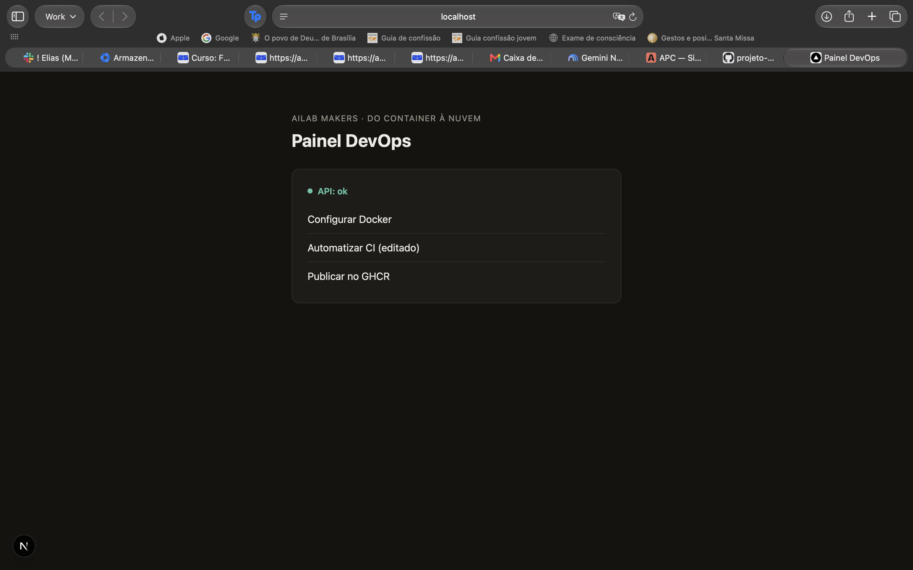

Depois de editar um item em `backend/api/views.py`, o runserver recarregou sozinho e a página mostrou o texto novo, sem `docker build`:

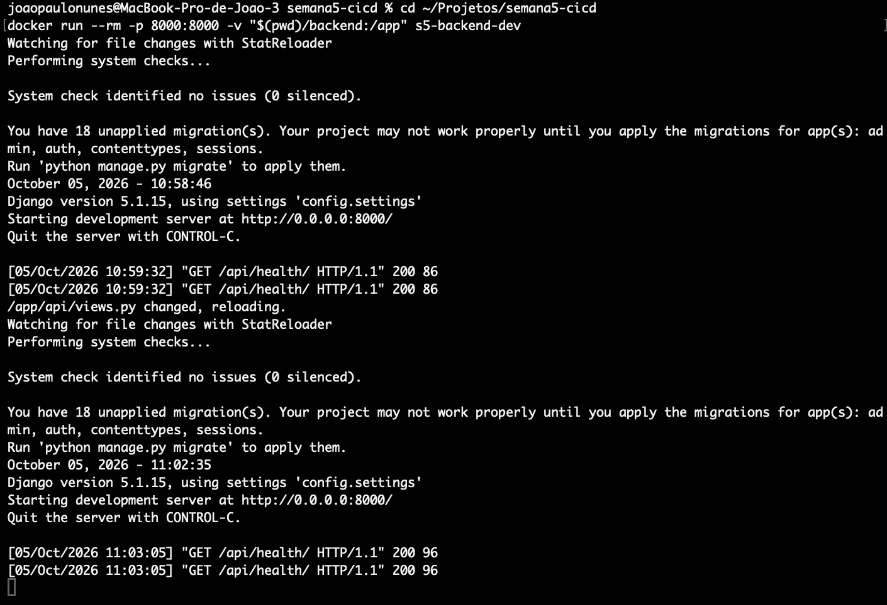

Depois de editar o título em `frontend/app/page.js`, o hot reload do Next.js atualizou a página sem rebuild:

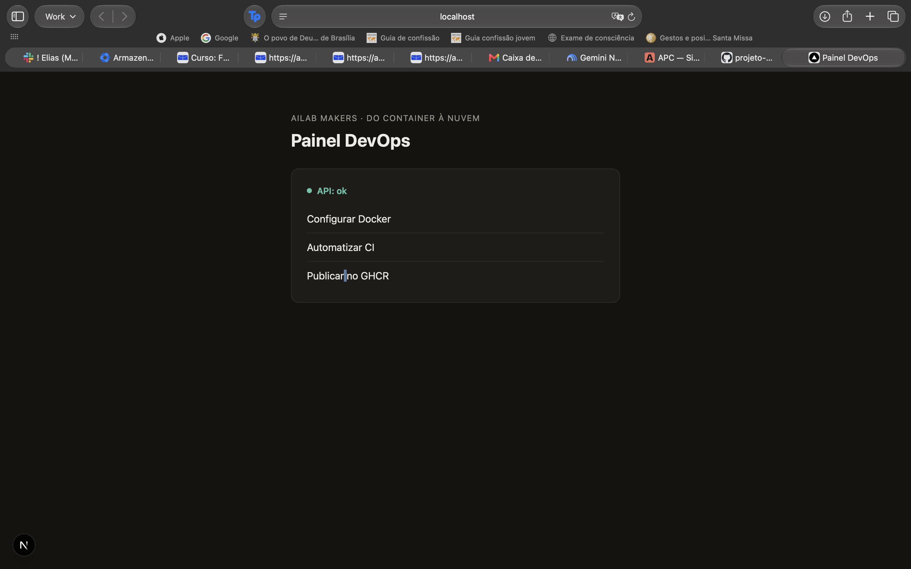

As duas edições aplicadas ao mesmo tempo:

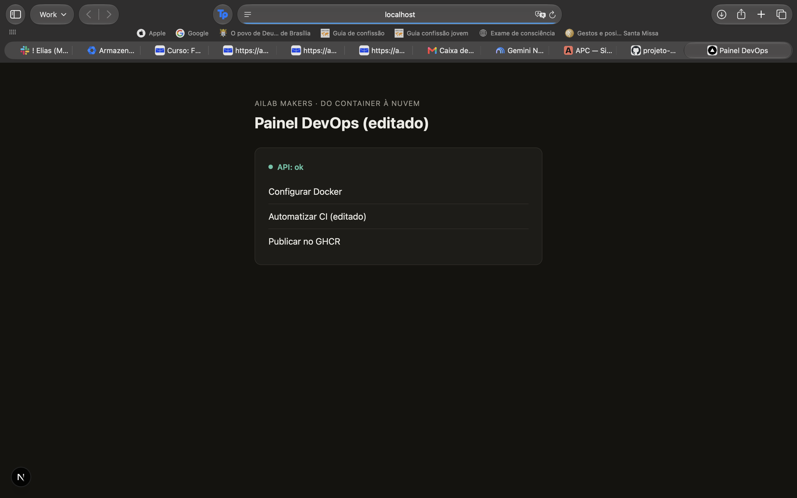

**Commit:** [`7f44842`](https://github.com/jpnunes2210/semana5-cicd/commit/7f44842)

## 4. Etapa 2 - Docker Compose

**Implementação**

- `docker-compose.yml` na raiz com `db`, `backend` e `frontend` na rede padrão do Compose. O backend recebe `POSTGRES_HOST=db` e acessa o banco por `db:5432`.
- Antes do runserver o backend executa `python manage.py migrate --noinput`.
- Variáveis: `.env.example` versionado; `.env` local criado com `cp .env.example .env` e ignorado no `.gitignore`.

**Healthcheck**

```yaml
healthcheck:
  test: ["CMD-SHELL", "pg_isready -U $$POSTGRES_USER -d $$POSTGRES_DB"]
  interval: 5s
  timeout: 5s
  retries: 5
```

O backend usa `depends_on: db: condition: service_healthy`, então só sobe quando o PostgreSQL aceita conexões. O `$$` faz o Compose repassar a variável para o shell do container em vez de interpolar.

**Persistência:** volume nomeado `postgres_data` montado em `/var/lib/postgresql/data`. Um `docker compose down` seguido de `up` mantém os dados; só `down -v` apaga.

**Validação (Checkpoint 2)**

```bash
cp .env.example .env
docker compose config -q          # sintaxe validada
docker compose up --build
docker compose ps                 # db com status (healthy)
curl http://localhost:8000/api/health/
```

`docker compose ps` com o `db` em `healthy`:

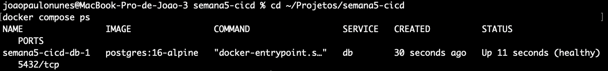

Frontend da stack do Compose consumindo a API:


**Commit:** [`959098f`](https://github.com/jpnunes2210/semana5-cicd/commit/959098f)

## 5. Etapa 3 - CI

Arquivo: [`.github/workflows/ci.yml`](https://github.com/jpnunes2210/semana5-cicd/blob/main/.github/workflows/ci.yml). Dispara em push (qualquer branch), pull request e manualmente.

**Jobs do backend**

| Job | needs | O que faz |
|---|---|---|
| `lint-backend` | nenhum | `ruff check .` (regras E, F, W, I) |
| `build-backend` | `lint-backend` | `docker build ./backend` e `manage.py check` dentro do container |
| `test-backend` | `build-backend` | `python manage.py test` contra um PostgreSQL 16 de serviço do Actions |

**Jobs do frontend**

| Job | needs | O que faz |
|---|---|---|
| `lint-frontend` | nenhum | `npm run lint` (ESLint com `eslint-config-next`) |
| `build-frontend` | `lint-frontend` | `npm run build` |
| `test-frontend` | `build-frontend` | `npm test` (Vitest + Testing Library, 2 testes) |

As duas trilhas não dependem uma da outra: uma falha no backend não impede a trilha do frontend de rodar.

**Testes**

- Backend (`api/tests.py`): status 200 e JSON, lista exata dos 3 itens, `POST` devolve 405.
- Frontend (`__tests__/page.test.jsx`): renderiza os itens com `fetch` simulado e mostra "Dados indisponíveis" quando o `fetch` falha.

**Cache:** `actions/setup-python` com `cache: 'pip'` e `actions/setup-node` com `cache: 'npm'`, cada um apontando para o arquivo de dependências do serviço (`cache-dependency-path`).

**Fail-Fast:** o repositório tem três branches, cada uma com um único commit que quebra uma etapa diferente. Validei localmente que cada uma falha exatamente onde deveria:

| Branch | Erro proposital | Job que falha | Jobs pulados |
|---|---|---|---|
| `failfast/lint` | `import os` não usado em `api/views.py` | `lint-backend` (Ruff F401) | `build-backend`, `test-backend` |
| `failfast/build` | import de `@/lib/nao-existe` em `app/page.js` | `build-frontend` (`next build`) | `test-frontend` |
| `failfast/test` | item "Publicar no GHCR" trocado por "Publicar no Docker Hub" | `test-backend` | nenhum |

A correção final é a própria `main`, com as duas trilhas verdes.

**Evidências**

- Runs da `failfast/lint` (vermelho no lint, build e test pulados): https://github.com/jpnunes2210/semana5-cicd/actions?query=branch%3Afailfast%2Flint
- Runs da `failfast/build`: https://github.com/jpnunes2210/semana5-cicd/actions?query=branch%3Afailfast%2Fbuild
- Runs da `failfast/test`: https://github.com/jpnunes2210/semana5-cicd/actions?query=branch%3Afailfast%2Ftest
- Runs verdes da `main`: https://github.com/jpnunes2210/semana5-cicd/actions/workflows/ci.yml?query=branch%3Amain

Visão geral da aba Actions logo após o push: os três runs de fail-fast vermelhos e os runs da `main` verdes.

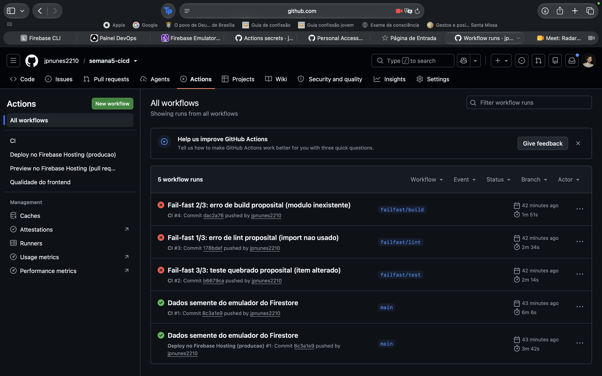

**Commit:** [`c8e4905`](https://github.com/jpnunes2210/semana5-cicd/commit/c8e4905)

## 6. Etapa 4 - Producao

**Backend** (`backend/Dockerfile.prod`)

- Multi-stage: o estágio `builder` cria um virtualenv em `/opt/venv` com as dependências; o estágio `runtime` copia apenas o venv e o código.
- Base `python:3.12-alpine`, `DJANGO_DEBUG=False`.
- `collectstatic` no build; o WhiteNoise serve os estáticos do admin.
- `docker-entrypoint.sh` aplica `migrate` (desligável com `RUN_MIGRATIONS=false`) e passa o controle para o `CMD`:
  ```
  gunicorn config.wsgi:application --bind 0.0.0.0:8000 --workers 3
  ```
- Usuário `django` (uid 1001) definido com `USER django`.

**Frontend** (`frontend/Dockerfile.prod`)

- `deps`: `node:20-alpine`, `npm ci`.
- `builder`: copia `node_modules` do `deps` e roda `npm run build` com `output: 'standalone'`.
- `runner`: copia somente `.next/standalone`, `.next/static` e `public`, executa `node server.js` como usuário `nextjs` (uid 1001).

**Redução do tamanho.** Duas decisões fizeram diferença:

1. **Sharp fora do standalone.** O primeiro build standalone tinha 67 MB, dos quais 46 MB eram binários do `sharp` (otimização de imagens do `next/image`, que o app não usa). Com `images: { unoptimized: true }` e `outputFileTracingExcludes` para `@img` e `sharp`, o standalone caiu para cerca de 20 MB.
2. **Runner em `alpine:3.20` + `apk add nodejs`.** Em vez de `node:20-alpine` (cerca de 130 MB só a base, com npm, yarn e corepack). Apagar o npm numa camada posterior não ajudaria: os arquivos continuariam na camada da imagem base.

**Validação**

```bash
docker build -f backend/Dockerfile.prod  -t s5-backend:prod  ./backend
docker build -f frontend/Dockerfile.prod -t s5-frontend:prod ./frontend
docker images | grep s5-
docker run --rm s5-frontend:prod whoami                 # nextjs
docker run --rm --entrypoint whoami s5-backend:prod     # django
docker run --rm --entrypoint sh s5-frontend:prod -c "command -v npm || echo sem npm"
```

Validado fora do Docker: Gunicorn com `DEBUG=False` respondendo `/api/health/` e servindo `/static/admin/css/base.css` (200); `node server.js` do standalone respondendo 200.

**Tamanho final das imagens** (medido com `docker images` no Docker Desktop):

| Imagem | Desenvolvimento | Produção |
|---|---|---|
| frontend | 1,63 GB | **117 MB** |
| backend | 313 MB | **198 MB** |

O frontend de produção ficou abaixo do limite de 150 MB, uma redução de mais de 90% em relação à imagem de desenvolvimento. Os dois `whoami` retornaram `nextjs` e `django`.

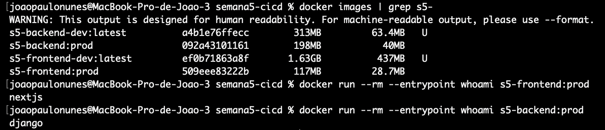

**Commit:** [`f50bbae`](https://github.com/jpnunes2210/semana5-cicd/commit/f50bbae)

## 7. Etapa 5 - Nginx e SSL

**Reverse proxy** (`nginx/nginx.conf`, montado em `/etc/nginx/conf.d/default.conf`):

| Location | Upstream |
|---|---|
| `/api/` | `backend:8000` |
| `/admin/` | `backend:8000` |
| `/static/` | `backend:8000` (estáticos do admin) |
| `/` | `frontend:3000` |

Os cabeçalhos `Host`, `X-Real-IP`, `X-Forwarded-For` e `X-Forwarded-Proto` são repassados. O Django usa `SECURE_PROXY_SSL_HEADER` para saber que a requisição original era HTTPS e `CSRF_TRUSTED_ORIGINS=https://localhost` para o login do admin.

**Portas expostas:** só o `nginx` tem `ports` (`80:80` e `443:443`). `backend`, `frontend` e `db` usam apenas `expose` ou nada, então não são alcançáveis pelo host.

**HTTPS:** `listen 443 ssl` com `http2 on`, TLS 1.2 e 1.3, certificado autoassinado gerado por `scripts/gerar-certificado.sh` (o mesmo `openssl req -x509 ... -subj "/CN=localhost"` do enunciado). Os arquivos `.key` e `.crt` são ignorados pelo Git.

**Redirecionamento:** o server da porta 80 responde `return 301 https://$host$request_uri;`.

**Validação (executada localmente com PostgreSQL 16, Gunicorn, Next standalone e Nginx):**

| Comando | Resultado |
|---|---|
| `curl -I http://localhost/api/health/` | `301` para `https://localhost/api/health/` |
| `curl -k https://localhost/api/health/` | `{"status": "ok", "items": [...]}` |
| `curl -k https://localhost/` | página com "Painel DevOps" |
| `curl -kI https://localhost/admin/` | `302` para `/admin/login/` |
| `curl -kI https://localhost/static/admin/css/base.css` | `200` |
| `curl -kI https://localhost/_next/static/chunks/...js` | `200` |

Com Docker:

```bash
./scripts/gerar-certificado.sh
cp .env.prod.example .env.prod
docker compose -f docker-compose-prod.yml up -d --build
docker compose -f docker-compose-prod.yml ps     # só nginx com portas publicadas
curl -I http://localhost:8000/api/health/        # deve falhar: porta não publicada
```

`docker compose -f docker-compose-prod.yml ps`: só o `nginx` publica portas.

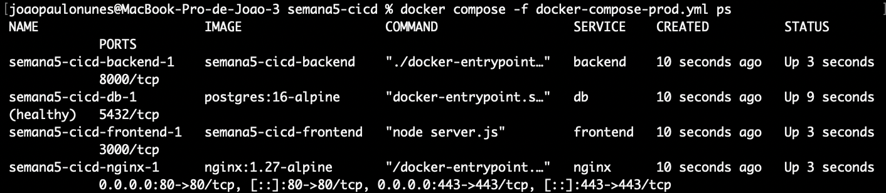

Testes com `curl`: 301 de HTTP para HTTPS, JSON da API via Nginx e porta 8000 inacessível pelo host.

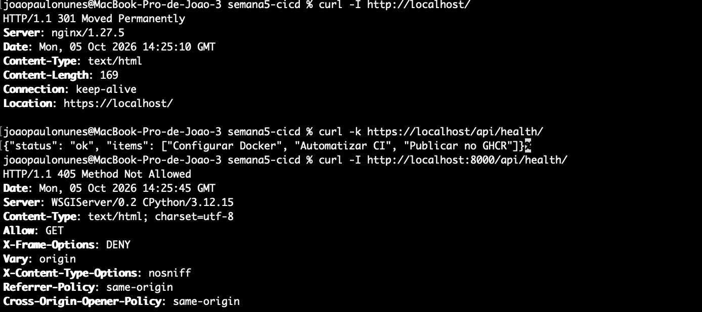

Navegador em `https://localhost` com o certificado autoassinado:

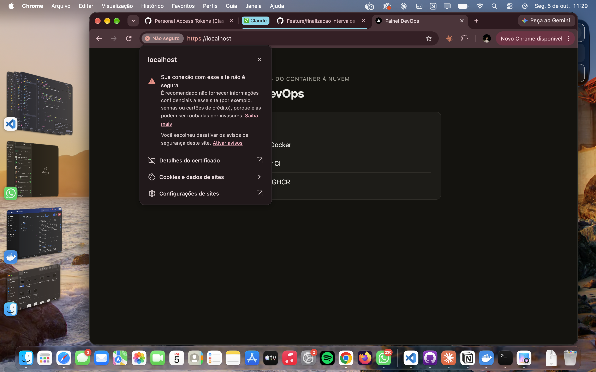

**Commit:** [`87a9121`](https://github.com/jpnunes2210/semana5-cicd/commit/87a9121)

## 8. Etapa 6 - GHCR

**Jobs**

| Job | needs | Condição |
|---|---|---|
| `deploy-backend` | `test-backend` | push na `main` |
| `deploy-frontend` | `test-frontend` | push na `main` |

Cada job faz login no `ghcr.io` com `docker/login-action` usando o `GITHUB_TOKEN` do próprio workflow, e publica com `docker/build-push-action` a partir do `Dockerfile.prod` do serviço. O nome da imagem é convertido para minúsculas (`${GITHUB_REPOSITORY,,}`), exigência do GHCR. O cache de camadas do Buildx usa o backend `gha`.

**Permissões**

```yaml
permissions:
  contents: read
  packages: write
```

Nenhum segredo manual: o `GITHUB_TOKEN` é gerado por run e expira ao fim dele.

**Tags**

```
ghcr.io/jpnunes2210/semana5-cicd-backend:latest
ghcr.io/jpnunes2210/semana5-cicd-backend:<github.sha>
ghcr.io/jpnunes2210/semana5-cicd-frontend:latest
ghcr.io/jpnunes2210/semana5-cicd-frontend:<github.sha>
```

**Evidências**

- Runs do CI na `main` (8 jobs verdes, incluindo os deploys): https://github.com/jpnunes2210/semana5-cicd/actions/workflows/ci.yml?query=branch%3Amain
- Pacotes públicos: [semana5-cicd-backend](https://github.com/users/jpnunes2210/packages/container/package/semana5-cicd-backend) e [semana5-cicd-frontend](https://github.com/users/jpnunes2210/packages/container/package/semana5-cicd-frontend)
- `docker pull` da imagem publicada. Como a imagem é `linux/amd64` (arquitetura dos runners do GitHub) e o Mac de teste é `arm64`, o pull usou `--platform linux/amd64`:

```bash
docker pull --platform linux/amd64 ghcr.io/jpnunes2210/semana5-cicd-frontend:latest
```

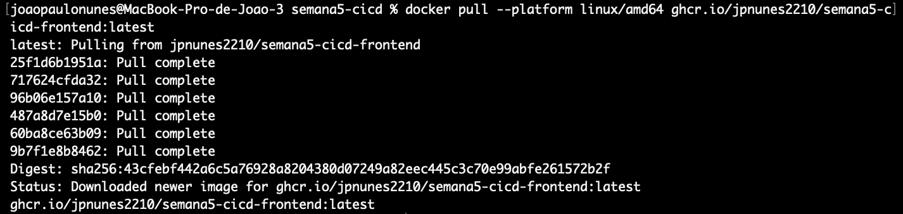

**Commit:** [`1553d55`](https://github.com/jpnunes2210/semana5-cicd/commit/1553d55)

## 9. Validacao Final

**Comandos executados e resultados**

| Comando | Resultado |
|---|---|
| `ruff check .` (backend) | All checks passed |
| `python manage.py test` com PostgreSQL 16 | 3 testes OK |
| `npm run lint` (frontend) | sem erros |
| `npm test` (frontend) | 2 testes OK |
| `npm run build` com `output: 'standalone'` | build OK, standalone de cerca de 20 MB |
| `actionlint .github/workflows/ci.yml` | sem erros |
| `docker compose config -q` (dev e prod) | sintaxe válida |
| Nginx `-t` + roteamento | ver tabela da Etapa 5 |
| Branches `failfast/*` | cada uma falha só no job esperado |

**Limitações conhecidas**

- Certificado autoassinado: o navegador mostra aviso; em produção real seria Let's Encrypt.
- As migrações rodam no entrypoint do backend. Com várias réplicas, o ideal é um job de migração separado.
- O `next dev` usa polling (`WATCHPACK_POLLING`) para o hot reload funcionar em bind mounts no Windows e no macOS, o que gasta um pouco mais de CPU.
- As imagens do GHCR são publicadas só para `linux/amd64`. Em Macs com chip Apple é preciso `--platform linux/amd64` (o Docker Desktop emula). Publicar também `linux/arm64` é uma linha no `build-push-action`, mas deixa o build mais lento.

**Checklist final**

| Etapa | Entregável | Status |
|---|---|---|
| 1 | Dockerfile em backend e frontend, hot reload e bind mounts | [x] |
| 2 | docker-compose.yml com healthcheck e persistência | [x] |
| 3 | CI com trilhas lint → build → test | [x] |
| 4 | Dockerfile.prod multi-stage e imagens reduzidas | [x] |
| 5 | docker-compose-prod.yml + Nginx + SSL + portas isoladas | [x] |
| 6 | Publicação no GHCR com :latest e :sha | [x] |

## 10. Historico Git

| Etapa | Commit | Descrição |
|---|---|---|
| 1 | [`7f44842`](https://github.com/jpnunes2210/semana5-cicd/commit/7f44842) | Django + Next.js, endpoint `/api/health/`, Dockerfiles de dev com bind mount e hot reload |
| 2 | [`959098f`](https://github.com/jpnunes2210/semana5-cicd/commit/959098f) | Compose com db, rede interna, volume `postgres_data`, healthcheck e `.env.example` |
| 3 | [`c8e4905`](https://github.com/jpnunes2210/semana5-cicd/commit/c8e4905) | Workflow de CI com duas trilhas fail-fast, testes e cache pip/npm |
| 4 | [`f50bbae`](https://github.com/jpnunes2210/semana5-cicd/commit/f50bbae) | Dockerfile.prod do backend (Gunicorn, não root) e do frontend (multi-stage, standalone) |
| 5 | [`87a9121`](https://github.com/jpnunes2210/semana5-cicd/commit/87a9121) | Compose de produção, Nginx com HTTPS, redirecionamento 301 e portas isoladas |
| 6 | [`1553d55`](https://github.com/jpnunes2210/semana5-cicd/commit/1553d55) | Jobs de deploy no GHCR com tags `latest` e SHA |
