# Semana 6 - Do Container a Nuvem (GCP e Firebase)

> Evidências coletadas em 05/10/2026. As capturas ficam em `docs/semana6/img/`.

## 1. Identificacao

- **Aluno:** João Paulo Barbosa Pereira Nunes
- **Repositório:** https://github.com/jpnunes2210/semana5-cicd (mesmo repositório da Semana 5)
- **URL de produção:** https://semana6-jpnunes.web.app
- **URL do canal (Versão B):** https://semana6-jpnunes--versao-b-bv3t437n.web.app (expira 7 dias após o deploy)
- **URL de preview do PR #1:** https://semana6-jpnunes--pr1-teste-preview-qa78c8eo.web.app

## 2. Arquitetura

**Diagrama**

```
                         ┌──────────────── Firebase (plano Spark) ────────────────┐
Navegador ──HTTPS──> Firebase Hosting (CDN, .web.app, TLS gerenciado)              │
    │                    └─ frontend/out (export estático do Next.js)             │
    │                                                                              │
    └──SDK web (firebase/firestore)──> Cloud Firestore: coleção items             │
                                         regras: leitura pública, escrita negada  │
                         └─────────────────────────────────────────────────────────┘

GitHub ── PR ───> Actions: qualidade → build estático → canal de preview → curl --fail
       └─ merge ─> Actions: qualidade → build estático → canal live    → curl --fail
```

**Fluxo de requisição**

1. O navegador baixa `index.html` e os chunks JS da CDN do Firebase Hosting.
2. O Client Component `app/page.js` chama `fetchItems()` de `lib/data-source.js`.
3. Com `NEXT_PUBLIC_DATA_SOURCE=firestore`, o SDK do Firebase é carregado por import dinâmico e lê `items` ordenados por `ordem`.
4. A resposta é convertida para o mesmo JSON da API Django (`{ "status": "ok", "items": [...] }`), então a tela é igual à da Semana 5.
5. Se a leitura falhar (sem rede, cota esgotada), a página mostra "Dados indisponíveis".

**O que continua no Docker local:** toda a Semana 5. Django, PostgreSQL, Nginx, `docker-compose.yml`, `docker-compose-prod.yml`, os Dockerfiles e o `ci.yml` (incluindo a publicação no GHCR) não foram removidos. O modo `standalone` continua sendo o padrão do build.

## 3. Etapa 1 - Projeto e CLI

**Plano Spark (evidência):**

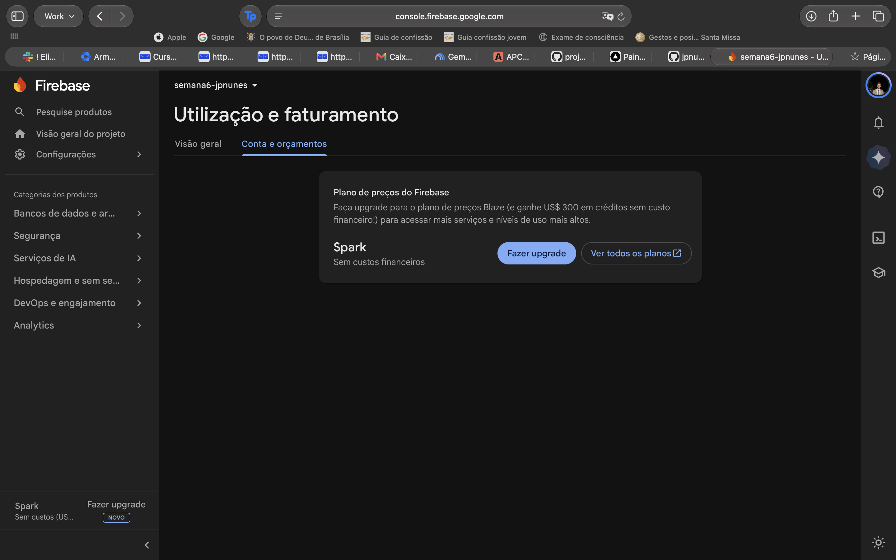

**Saída do `firebase projects:list`:**

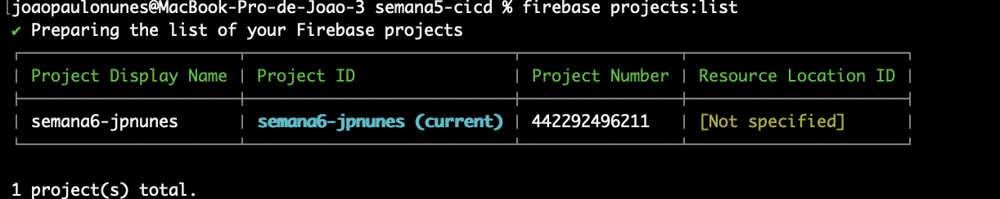

**Arquivos de configuração versionados**

| Arquivo | Conteúdo |
|---|---|
| `firebase.json` | Hosting com `public: frontend/out`, `cleanUrls`; Firestore com regras e índices |
| `.firebaserc` | projeto padrão |
| `firestore.rules` | começou fechada (`allow read, write: if false` para tudo) |
| `firestore.indexes.json` | sem índices compostos |
| `scripts/configurar-projeto.sh` | troca o ID de exemplo pelo ID real em todos os arquivos |

**Higiene do Git:** o `.gitignore` cobre `firebase-debug.log`, `firestore-debug.log`, `ui-debug.log`, `.firebase/` e padrões de JSON de conta de serviço (`*-firebase-adminsdk-*.json`, `*serviceAccount*.json`, `credentials*.json`). Verificação:

```bash
git log --all --name-only --format= | grep -iE "adminsdk|serviceaccount|credentials" || echo "nenhuma credencial no histórico"
```

**Commit:** [`554f8b7`](https://github.com/jpnunes2210/semana5-cicd/commit/554f8b7)

## 4. Etapa 2 - Deploy mais rapido

**Modo de exportação** (`frontend/next.config.mjs`):

```js
output: process.env.STATIC_EXPORT === 'true' ? 'export' : 'standalone',
```

| Comando | Saída |
|---|---|
| `npm run build` | `.next/standalone` com `server.js` (Semana 5) |
| `npm run build:static` | `out/index.html` e assets (Semana 6) |

**Estado de erro amigável:** o fetch acontece no navegador. No Hosting não existe `/api/health/`; validei no emulador de Hosting que essa rota devolve 404, e o `fetchHealth` trata qualquer resposta não 200 como erro, levando a página para "Dados indisponíveis". Há um teste automatizado específico para a resposta 404.

**Semana 5 continua funcionando:** depois da mudança, `npm run build` ainda gera `.next/standalone/server.js` (cerca de 21 MB) e o `Dockerfile.prod` não foi alterado. O `ci.yml` da Semana 5 segue no repositório.

**Validação**

```bash
cd frontend && npm run build:static && cd ..
firebase deploy --only hosting
curl -I https://semana6-jpnunes.web.app     # HTTP/2 200
```

Localmente, com `firebase emulators:exec --only hosting`: `GET /` 200 com "Painel DevOps"; `GET /api/health/` 404.

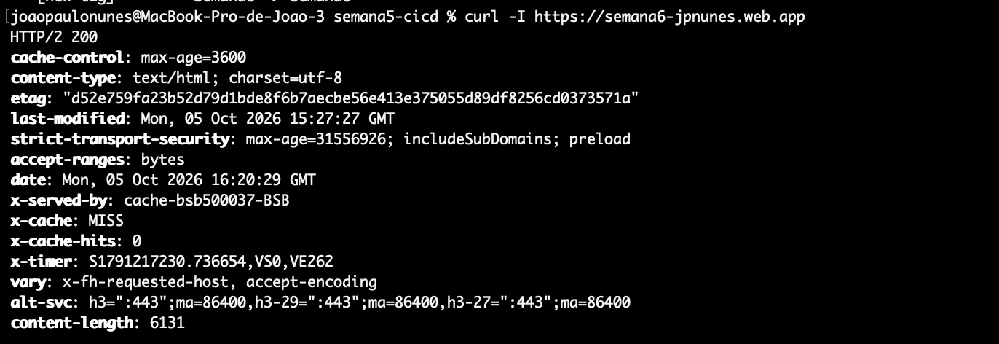

**Tempo (opcional):** não medido.

**Commit:** [`2b7c3b2`](https://github.com/jpnunes2210/semana5-cicd/commit/2b7c3b2)

## 5. Etapa 3 - Emulator Suite

**Configuração dos emuladores** (`firebase.json`): Hosting 5002, Firestore 8080, UI 4000, `singleProjectMode`.

**Fonte de dados**

| Variável | Valor | Efeito |
|---|---|---|
| `NEXT_PUBLIC_DATA_SOURCE` | `api` (padrão) | `fetch` em `/api/health/` (Django) |
| `NEXT_PUBLIC_DATA_SOURCE` | `firestore` | lê a coleção `items` e devolve o mesmo JSON |
| `NEXT_PUBLIC_USE_EMULATOR` | `true` | `connectFirestoreEmulator(db, "127.0.0.1", 8080)` |

Só o `frontend/.env.example` é versionado. O SDK do Firebase é importado sob demanda, então o modo `api` não carrega esse código.

**Regras** (as mesmas do nível 3 da Missão Farol, aplicadas a `items`):

```
match /items/{item} {
  allow read: if true;
  allow write: if false;
}
```

Qualquer outra coleção continua negada por não ter regra.

**Dados semente:** `scripts/seed-emulator.mjs` grava os 3 itens da Semana 5 (`item-1` a `item-3`, campos `texto` e `ordem`) usando o token `Bearer owner` do emulador, que ignora as regras como o console faz em produção. `scripts/emuladores.sh` sobe tudo com `--import=./firebase/seed --export-on-exit=./firebase/seed`.

**Testes automatizados das regras** (`frontend/rules-tests/firestore.rules.test.js`, com `@firebase/rules-unit-testing`):

| Caso | Esperado |
|---|---|
| anônimo lê `items/item-1` | permitido |
| anônimo grava em `items` | negado |
| usuário logado grava em `items` | negado |
| anônimo lê outra coleção | negado |

Esses testes rodam no CI (job `test-rules`) com `firebase emulators:exec`.

**Leitura permitida / escrita negada:**

Página em `localhost:5002` listando os 3 itens do emulador:

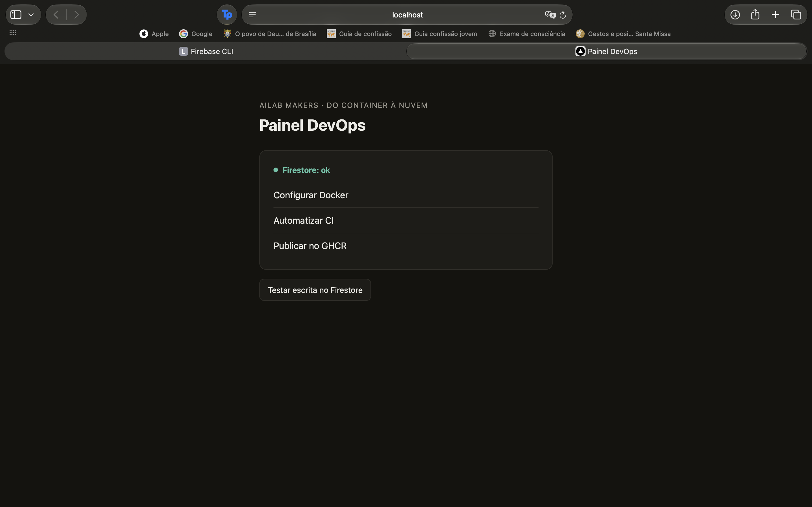

Botão "Testar escrita no Firestore" bloqueado pelas regras:

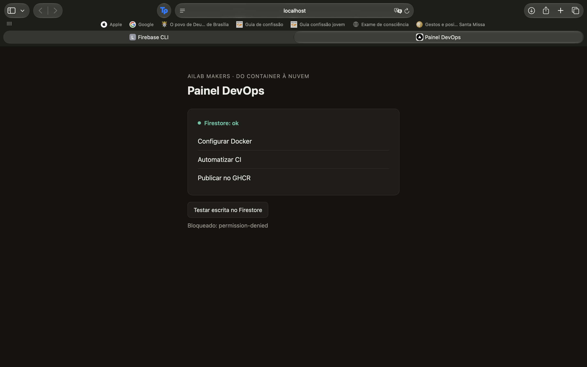

Emulator UI > Firestore > Requests com a leitura permitida e a escrita negada:

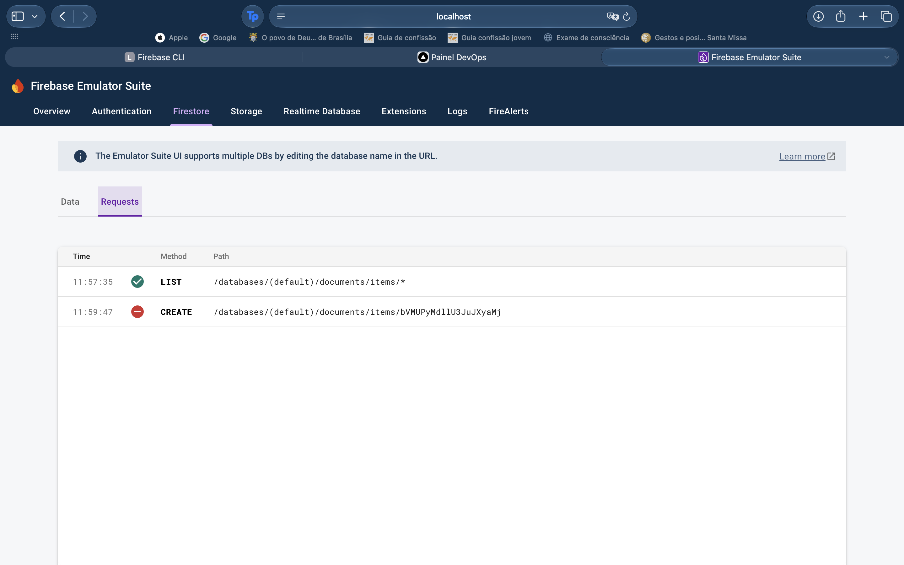

Testes automatizados das regras rodando contra o emulador:

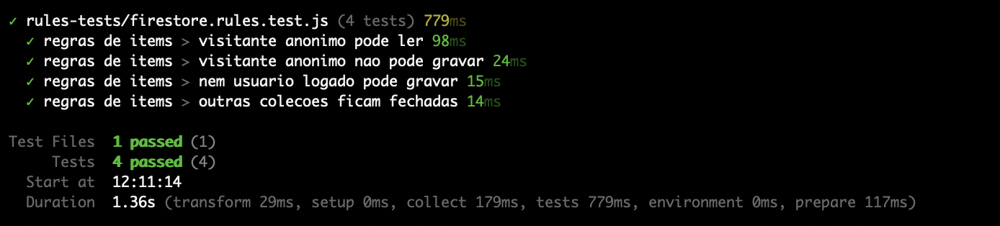

No macOS a porta 5000 é ocupada pelo Receptor AirPlay, por isso o emulador de Hosting usa a 5002.

**Commits:** [`4581c97`](https://github.com/jpnunes2210/semana5-cicd/commit/4581c97), [`0548085`](https://github.com/jpnunes2210/semana5-cicd/commit/0548085) (porta 5002) e [`8c3a1e9`](https://github.com/jpnunes2210/semana5-cicd/commit/8c3a1e9) (dados semente exportados em `firebase/seed`)

## 6. Etapa 4 - Firestore de producao e Versao B

**Regras publicadas:** `firebase deploy --only firestore:rules` terminou com `released rules firestore.rules to cloud.firestore` e `Deploy complete!`.

**Dados de produção:** banco `(default)` criado em modo de produção no plano Spark (`southamerica-east1`), com a coleção `items` e os 3 documentos cadastrados pelo console (campos `texto` string e `ordem` number):

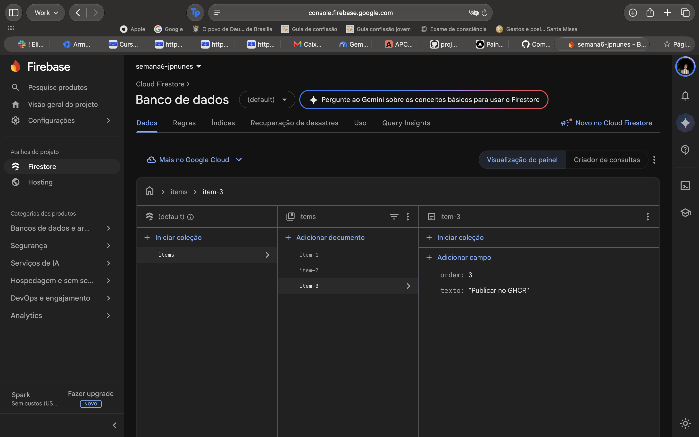

**Incidente durante a validação:** no primeiro deploy a produção mostrava "Firestore: ok" com a lista vazia, e o botão de escrita ficava em "Tentando gravar...". A causa era dupla: o app Web não tinha sido registrado (a config ainda tinha os valores de exemplo) e o banco Firestore não existia no projeto, o que o `firebase firestore:databases:list` confirmou com o erro "Cloud Firestore API has not been used". A config foi corrigida no PR [#1](https://github.com/jpnunes2210/semana5-cicd/pull/1), o banco foi criado e os itens cadastrados. A página voltou a listar os dados sem novo deploy, porque a leitura acontece no navegador.

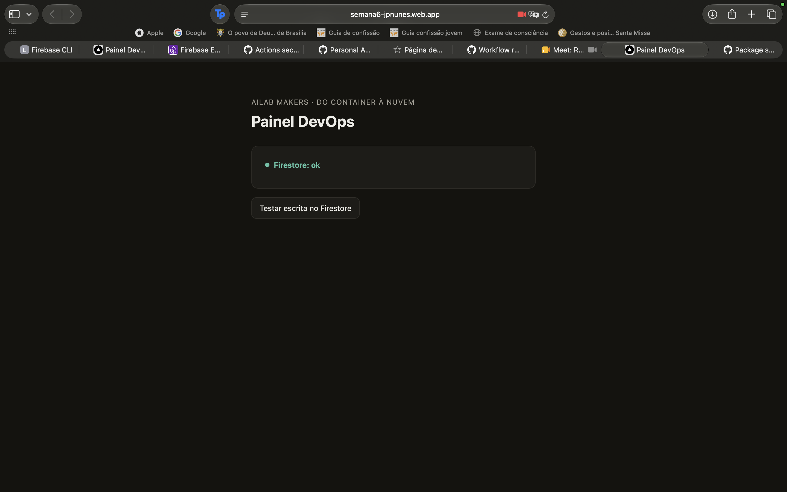

**Canal da Versão B:** `NEXT_PUBLIC_APP_VARIANT=b` muda o título para "Painel DevOps · Versão B" e a cor de destaque para âmbar.

```bash
./scripts/deploy-producao.sh      # canal live
./scripts/deploy-versao-b.sh      # firebase hosting:channel:deploy versao-b --expires 7d
```

Produção (esquerda) e canal da Versão B (direita) no ar ao mesmo tempo:

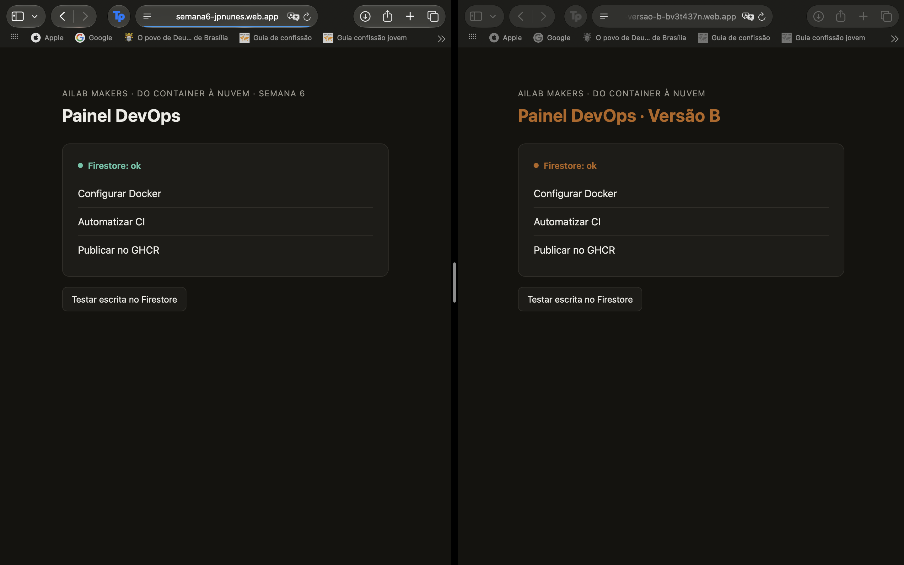

Produção depois do merge do PR #1:


**Escrita negada em produção:** botão "Testar escrita no Firestore" respondendo `Bloqueado: permission-denied`:

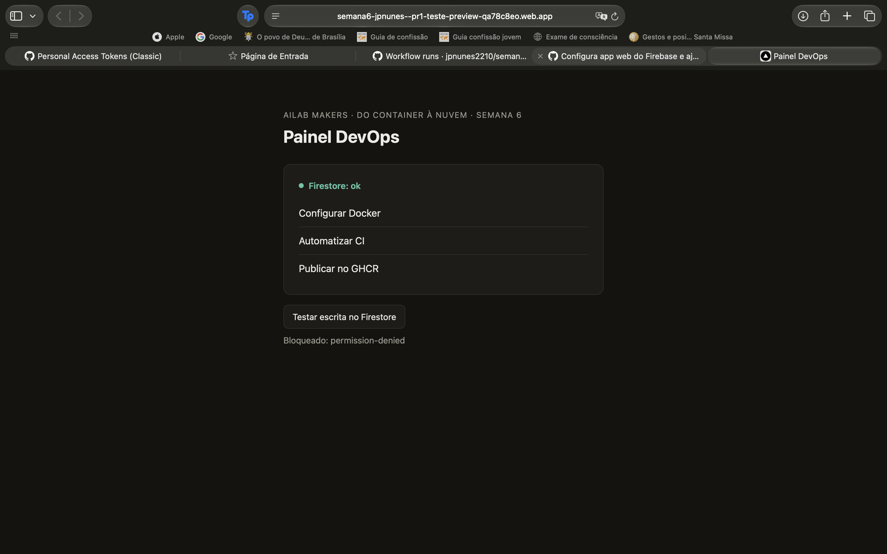

**Rollback:** Hosting > Histórico de versões > versão anterior > Reverter.

| Momento | Versão ativa no live | Evidência |
|---|---|---|
| Antes | `b1c0a5`, "Release com problema: Versao B publicada por engano" (13:25) | `img/etapa4-rollback-antes.png`, `img/etapa4-rollback-antes-pagina.png` |
| Depois do rollback | `3c0ce6`, versão publicada pelo GitHub Actions (12:27), restaurada às 13:29 | `img/etapa4-rollback-depois.png`, `img/etapa4-rollback-historico.png` |

Para simular uma release com problema, a Versão B foi publicada por engano no canal live e depois revertida pelo console:

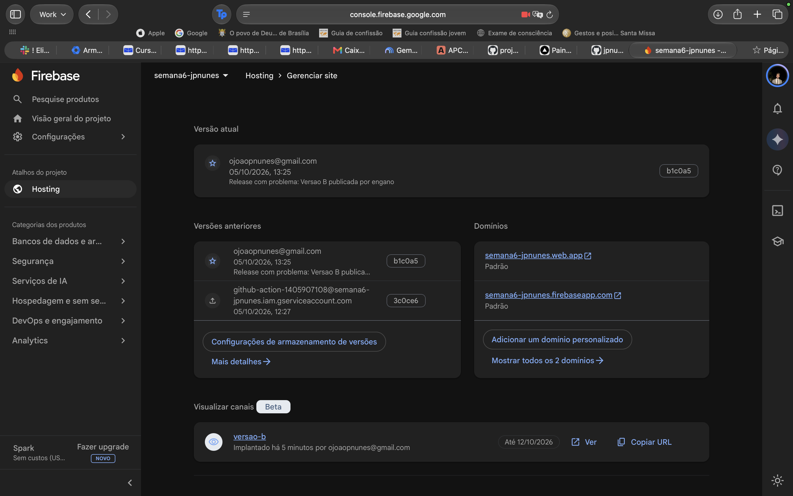

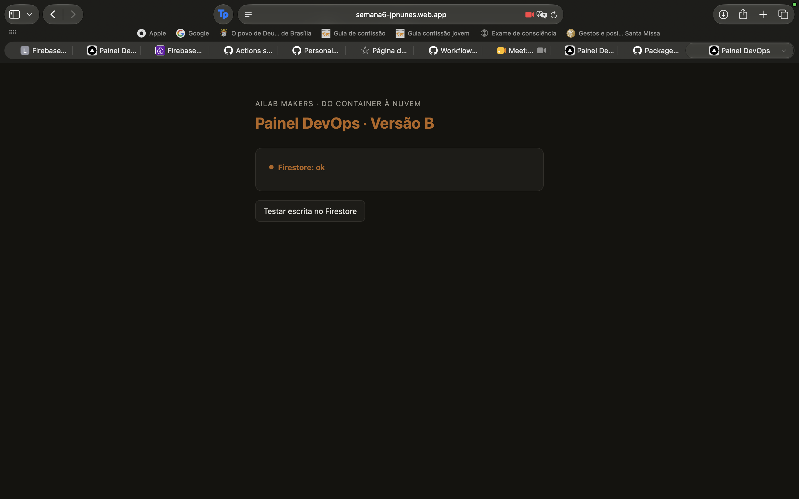

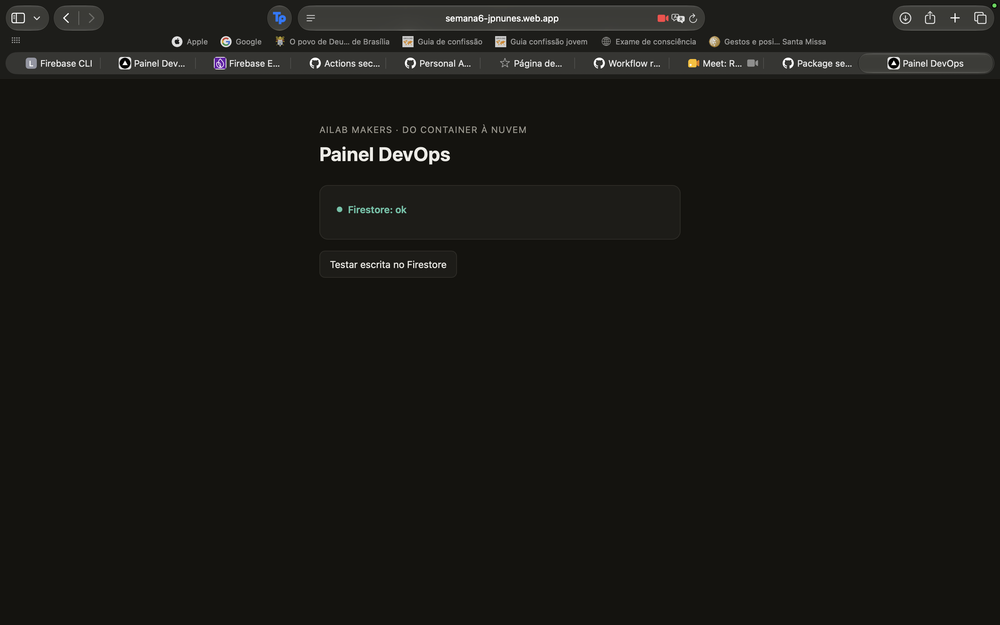

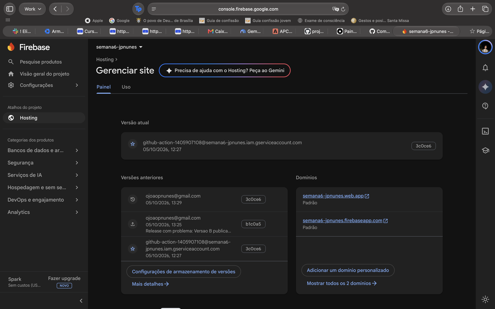

**Commit:** [`30e1c41`](https://github.com/jpnunes2210/semana5-cicd/commit/30e1c41)

## 7. Etapa 5 - CD com GitHub Actions

**Workflow**

| Arquivo | Gatilho | Jobs (`needs` em cadeia) |
|---|---|---|
| `frontend-qualidade.yml` | `workflow_call` | `lint` → (`test`, `test-rules`) |
| `firebase-hosting-pull-request.yml` | `pull_request` | `qualidade` → `build` → `preview` → `smoke-test` |
| `firebase-hosting-merge.yml` | push na `main` | `qualidade` → `build` → `deploy` → `smoke-test` |

- O `build` roda `npm run build:static` com `NEXT_PUBLIC_DATA_SOURCE=firestore` e entrega `frontend/out` como artifact para o job de deploy.
- `concurrency`: o merge usa o grupo `firebase-hosting-live` sem cancelar (deploys de produção entram em fila); o PR usa um grupo por número de PR com `cancel-in-progress: true`.
- PRs vindos de fork são ignorados, porque não têm acesso ao secret.
- `firebase init hosting:github` foi usado só para criar a conta de serviço e o secret; os workflows gerados por ele não sobrescreveram os do repositório.

**Preview em PR:** a action `FirebaseExtended/action-hosting-deploy@v0` publica num canal com expiração de 7 dias e comenta a URL no PR. No [PR #1](https://github.com/jpnunes2210/semana5-cicd/pull/1) o bot comentou https://semana6-jpnunes--pr1-teste-preview-qa78c8eo.web.app, e o preview foi usado para validar a correção da config antes do merge.

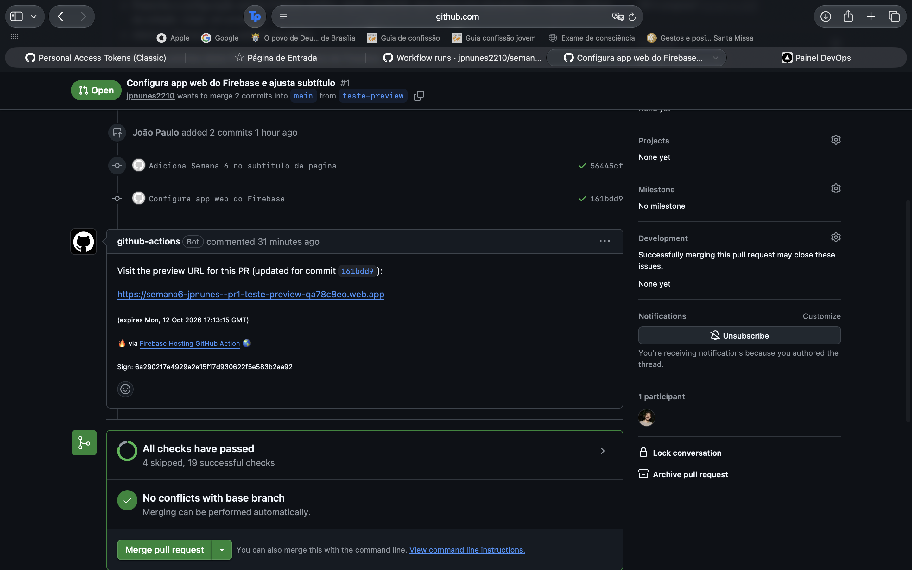

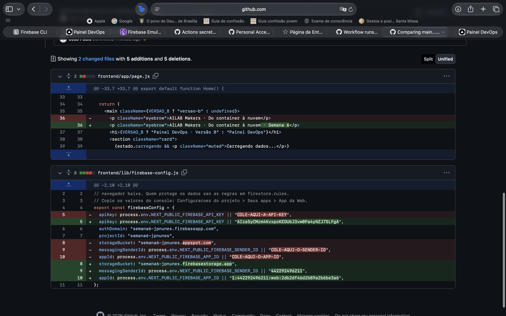

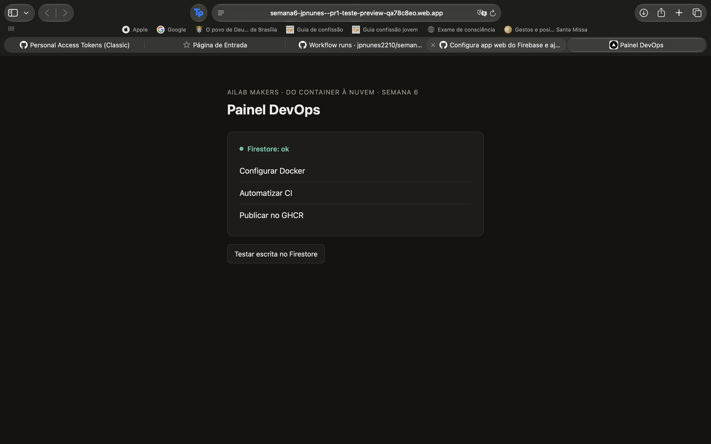

**Deploy no merge:** `channelId: live`. Runs: https://github.com/jpnunes2210/semana5-cicd/actions/workflows/firebase-hosting-merge.yml

**Teste de fumaça:** `curl --fail --retry 5` na URL publicada e `grep "Painel DevOps"` no HTML. No PR a URL vem da saída `details_url` da action; no merge é `https://<projeto>.web.app/`, porque a action não preenche saídas no deploy live. Jobs `smoke-test` verdes nos runs de https://github.com/jpnunes2210/semana5-cicd/actions/workflows/firebase-hosting-merge.yml e https://github.com/jpnunes2210/semana5-cicd/actions/workflows/firebase-hosting-pull-request.yml

**Reflexão sobre a chave JSON**

Aqui a chave é aceitável: a conta de serviço criada pela CLI só tem papéis de Hosting, o projeto é acadêmico no plano Spark (não há cobrança a abusar) e a chave fica apenas no GitHub Secrets, mascarada nos logs e fora do repositório. O risco que sobra é o de toda chave de longa duração: ela não expira sozinha, e quem a obtiver (por um log mal configurado, por um colaborador com acesso de admin ao repositório ou por uma action de terceiros comprometida) consegue publicar no site até alguém revogá-la manualmente.

Com **Workload Identity Federation** não existe chave. O GitHub emite um token OIDC por execução, o Google o troca por uma credencial de curta duração (cerca de 1 hora) e uma condição de atributo restringe quem pode usar a conta de serviço, por exemplo `assertion.repository == "jpnunes2210/semana5-cicd" && assertion.ref == "refs/heads/main"`. Valeria a pena quando houver recursos com custo ou dados reais (Cloud Run, Cloud SQL), vários repositórios ou pessoas com acesso, ou exigência de auditoria e rotação. Para este exercício, configurar o pool e o provider seria mais trabalho do que o risco justifica.

**Commit:** [`0a396a9`](https://github.com/jpnunes2210/semana5-cicd/commit/0a396a9)

## 8. Desenho de producao gerenciada

Desenho somente no papel: nenhum destes recursos foi criado.

| Componente | Servico equivalente | Configuracao |
|---|---|---|
| Backend Django (Gunicorn) | Cloud Run | Imagem do `Dockerfile.prod`, porta 8000, conta de serviço própria só com acesso ao Cloud SQL e ao segredo, `min-instances=0`, `max-instances=3`, variável `PORT` respeitada pelo Gunicorn |
| Imagens no GHCR | Artifact Registry | Repositório Docker na mesma região do Cloud Run; o CI publica com a tag do SHA e o deploy promove exatamente aquele SHA (nunca `latest`) |
| PostgreSQL | Cloud SQL para PostgreSQL 16 | `db-f1-micro`, IP privado ou conector do Cloud SQL no Cloud Run, backups automáticos diários, migrações num Cloud Run Job separado antes de liberar a revisão nova |
| Arquivo .env | Secret Manager | Um segredo por credencial (`DJANGO_SECRET_KEY`, `POSTGRES_PASSWORD`), papel `secretAccessor` só nesses segredos para a conta de serviço do backend |
| Nginx | Firebase Hosting + rewrite para o Cloud Run | `rewrites` com `"source": "/api/**"` e `/admin/**` apontando para o serviço do Cloud Run; mesma origem para o navegador (sem CORS); o Hosting só repassa o cookie chamado `__session`, o que afeta a sessão do admin |
| Chaves no GitHub | Workload Identity Federation | Pool e provider OIDC do GitHub, condição de atributo restrita a `jpnunes2210/semana5-cicd` e à `main`, conta de serviço de deploy com papéis mínimos |

**Custo mensal estimado** (us-central1, tráfego de projeto acadêmico, valores das páginas oficiais em outubro de 2026):

| Item | Base de cálculo | Custo |
|---|---|---|
| Cloud SQL `db-f1-micro` | instância compartilhada ligada 24 horas | cerca de US$ 8 |
| Armazenamento do Cloud SQL | 10 GB SSD, cerca de US$ 0,17/GB | cerca de US$ 1,70 |
| Cloud Run | dentro da cota gratuita mensal (2 milhões de requisições, 180 mil vCPU-segundos, 360 mil GiB-segundos) | US$ 0 |
| Artifact Registry | 2 imagens, cerca de 0,3 GB, dentro dos 0,5 GB gratuitos | US$ 0 |
| Secret Manager | 2 segredos ativos, dentro dos 6 gratuitos | US$ 0 |
| Firebase Hosting | dentro da cota | US$ 0 |
| **Total** | | **cerca de US$ 10 por mês**, quase tudo do Cloud SQL |

Fora da cota, o Cloud Run cobra US$ 0,000024 por vCPU-segundo, US$ 0,0000025 por GiB-segundo e US$ 0,40 por milhão de requisições.

**Por que o Spark não permite:** Cloud Run, Artifact Registry, Secret Manager e Cloud SQL exigem uma conta de faturamento vinculada (plano Blaze, com cartão), mesmo quando o uso ficaria dentro da cota gratuita. Além disso, o Cloud SQL não tem nível gratuito: a instância é cobrada por hora enquanto estiver ligada, use ou não.

Fontes: [Cloud Run pricing](https://cloud.google.com/run/pricing), [Cloud SQL pricing (Bytebase)](https://www.bytebase.com/dbcost/cloudsql-pricing/), [Artifact Registry pricing](https://cloud.google.com/artifact-registry/pricing), [Secret Manager pricing](https://cloud.google.com/secret-manager/pricing), [Firebase pricing](https://firebase.google.com/pricing).

## 9. Custo zero e limites

**Plano:** Spark, sem cartão cadastrado e sem botão de upgrade clicado.


**Cotas do Spark relevantes e uso estimado**

| Recurso | Cota gratuita | Uso deste projeto |
|---|---|---|
| Hosting: armazenamento | 10 GB | menos de 2 MB por versão |
| Hosting: transferência | 360 MB por dia | algumas centenas de KB por visita |
| Firestore: armazenamento | 1 GiB | 3 documentos |
| Firestore: leituras | 50 mil por dia | 3 leituras por visita |
| Firestore: gravações | 20 mil por dia | 3 (pelo console) |

Aba Uso do Firestore nas últimas 24 horas: 119 leituras, 13 gravações e 14 exclusões, muito abaixo das cotas diárias.

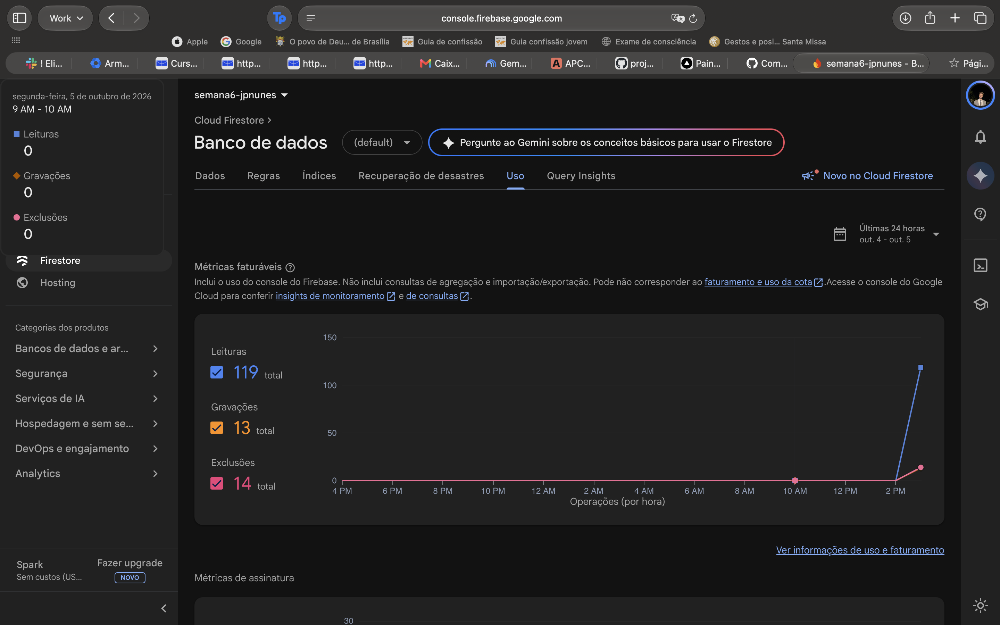

**Serviços NÃO habilitados:** Cloud Functions, Cloud Storage, App Hosting, Cloud Run, Cloud SQL, Artifact Registry, Secret Manager, Cloud Build, Compute Engine, Authentication por telefone e Firebase Studio.

## 10. Validacao final

**Comandos executados e resultados**

| Comando | Resultado |
|---|---|
| `npm run lint` | sem erros |
| `npm test` | 6 testes OK (página, fonte de dados, 404 da API, Versão B) |
| `npm run build` | standalone gerado, Semana 5 intacta |
| `npm run build:static` (modos `api` e `firestore` + emulador) | `out/` gerado |
| `firebase emulators:exec --only hosting` | `/` 200, `/api/health/` 404 |
| `actionlint .github/workflows/*.yml` | sem erros |
| `firebase emulators:exec --only firestore --project demo-regras "npm --prefix frontend run test:rules"` | 4 testes OK |
| `curl -I https://semana6-jpnunes.web.app` | `HTTP/2 200` |

**Limitações conhecidas**

- O backend Django não está na nuvem; com `NEXT_PUBLIC_DATA_SOURCE=api` o site no Hosting mostra o estado de erro, por desenho.
- A cota diária do Firestore no Spark corta as leituras ao ser atingida, e a página passa a mostrar "Dados indisponíveis" até o próximo ciclo.
- O botão de teste de escrita fica visível em produção para demonstrar as regras; num produto real ele seria removido.
- A chave da conta de serviço no GitHub Secrets é de longa duração (ver reflexão da Etapa 5).

## 11. Historico Git

| Etapa | Commit | Descrição |
|---|---|---|
| 1 | [`554f8b7`](https://github.com/jpnunes2210/semana5-cicd/commit/554f8b7) | `firebase.json`, `.firebaserc`, regras fechadas, `.gitignore` de credenciais e script de configuração do projeto |
| 2 | [`2b7c3b2`](https://github.com/jpnunes2210/semana5-cicd/commit/2b7c3b2) | Export estático por `STATIC_EXPORT`, mantendo o standalone, com estado amigável testado |
| 3 | [`4581c97`](https://github.com/jpnunes2210/semana5-cicd/commit/4581c97) | Emuladores, fonte de dados por variável, regras de `items`, scripts de semente e testes de regras |
| 4 | [`30e1c41`](https://github.com/jpnunes2210/semana5-cicd/commit/30e1c41) | Versão B por variável, scripts de deploy de produção e de canal, roteiro de rollback |
| 5 | [`0a396a9`](https://github.com/jpnunes2210/semana5-cicd/commit/0a396a9) | Workflows de preview em PR e deploy no merge, com qualidade, concurrency e teste de fumaça |
| 3 | [`0548085`](https://github.com/jpnunes2210/semana5-cicd/commit/0548085) | Emulador de Hosting na porta 5002 (a 5000 é usada pelo AirPlay no macOS) |
| 3 | [`8c3a1e9`](https://github.com/jpnunes2210/semana5-cicd/commit/8c3a1e9) | Dados semente do emulador exportados em `firebase/seed` |
| 4 e 5 | [`161bdd9`](https://github.com/jpnunes2210/semana5-cicd/commit/161bdd9) | Config web do Firebase preenchida (PR #1) |
| 5 | [`56445cf`](https://github.com/jpnunes2210/semana5-cicd/commit/56445cf) | Subtítulo "Semana 6", usado para validar o preview do PR #1 |
